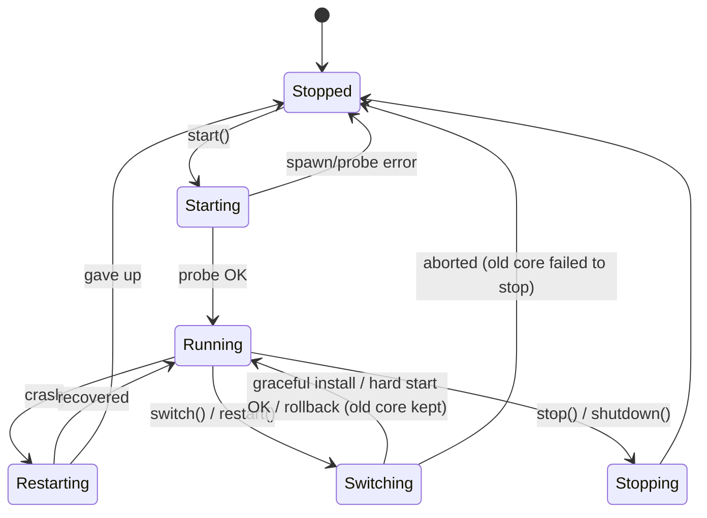
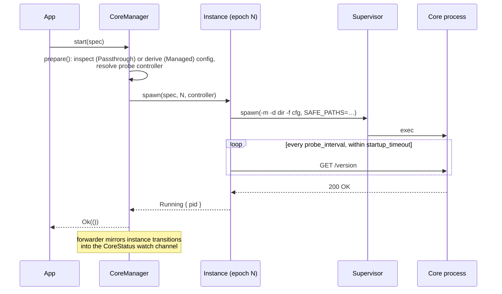

# nyanpasu-core-manager

Clash core lifecycle management: epoch-based instances, health-probed startup,
crash recovery, and hitless core switching.

The crate manages a proxy core process (mihomo, clash-rs, …) as an immutable,
single-epoch `Instance`, and layers a `CoreManager` on top that owns
start/stop/switch orchestration and publishes a unified `CoreStatus` snapshot
over a `watch` channel.

Key concepts:

- **Epochs** — an `Instance` is immutable. Changing the config never mutates a
  running core; the manager spawns a new instance with a new epoch and retires
  the old one.
- **Health-probed startup** — a start is only confirmed once
  `GET /version` on the core's external controller answers. `startup_timeout`
  is a *total* budget covering spawn, crash retries, and probing.
- **Supervision** — crash → backoff → respawn → re-probe, bounded by
  `RestartPolicy`/`Backoff` from `nyanpasu-utils`. Dropping an `Instance`
  without `stop()` kills the whole process tree.
- **Controller modes** — `Passthrough` probes the endpoint written in the
  user's config; `Managed` rewrites the config to a manager-owned, per-epoch
  local transport (named pipe on Windows, unix socket elsewhere), which is the
  prerequisite for graceful switching.

## Requirements on the config

The config must declare an external controller — it is the probe/control
channel. `external-controller-pipe` (Windows) / `external-controller-unix`
(Unix) take priority over `external-controller` (HTTP). Wildcard HTTP binds
(`0.0.0.0`, `::`, `:port`) are probed via loopback. For mihomo, the manager
sets `SAFE_PATHS` to the working dir plus the config dir.

## Instance state machine

Every instance starts in `Starting` and ends in exactly one `Stopped` state.
`InstanceState` is defined in [`src/state.rs`](src/state.rs).

```mermaid
stateDiagram-v2
    [*] --> Starting: Instance::spawn
    Starting --> Running: GET /version OK
    Starting --> Stopped: startup timeout / spawn failed / budget exhausted
    Running --> Restarting: process exited, restart budget left
    Restarting --> Running: respawn probe OK
    Restarting --> Stopped: budget exhausted / re-probe timed out
    Starting --> Stopping: stop()
    Running --> Stopping: stop() / Instance dropped
    Restarting --> Stopping: stop()
    Stopping --> Stopped: process tree dead
    Stopped --> [*]
```

`Stopped` carries a `StopReason`:

| Reason | Meaning |
| --- | --- |
| `Finished` | Core exited cleanly (code 0); no restart attempt. |
| `User` | Stopped via `stop()` / manager shutdown. |
| `Error(msg)` | Crash loop exhausted, probe timeout, or unexpected exit; `msg` includes a condensed stderr tail. |

## Manager state machine

`CoreManager` republishes instance transitions as `CoreState` (adding the
epoch), plus the `Switching` state that only exists at the manager level.
Steady-state forwarding is installed once a start/switch confirms `Running`.



## Sequence diagrams

### Start



### Graceful switch

Selected only in `Managed` mode, for mihomo, without `dns.listen`. The old
core keeps serving while the new one starts on zeroed listeners; traffic is
moved by restoring the listeners via API after the old core releases them.

```mermaid
sequenceDiagram
    participant App
    participant M as CoreManager
    participant A as Core A (epoch N)
    participant B as Core B (epoch N+1)

    App->>M: switch(spec B)
    M->>M: derive B′ (listeners zeroed, epoch-N+1 endpoint)
    M->>B: spawn + wait_ready
    Note over A: A keeps serving traffic
    M->>A: stop() — ports released (point of no return)
    M->>B: PATCH /configs — restore listeners (3 tries × 500 ms)
    alt patch succeeded
        M-->>App: SwitchOutcome::Graceful
    else patch failed
        M->>B: stop(); hard restart B on the full config (same epoch)
        M-->>App: SwitchOutcome::Hard { PatchFailed }
    end
```

Any failure before the point of no return (derive, spawn, probe) rolls back
cleanly: the old core is untouched and `Running` is re-published.

### Switch degradation matrix

`switch()` / `restart()` return how the switch was actually executed:

| Condition | Outcome |
| --- | --- |
| No core currently running | plain start, `Hard { NotRunning }` |
| `ControllerMode::Passthrough` | `Hard { PassthroughMode }` |
| Core kind is not mihomo | `Hard { UnsupportedKind }` |
| Config sets `dns.listen` | `Hard { DnsListen }` |
| Listener-restore PATCH keeps failing | hard restart, `Hard { PatchFailed }` |
| Otherwise | `Graceful` |

## Usage

### Start and stop (Passthrough)

```rust
use camino::Utf8PathBuf;
use nyanpasu_core_manager::{
    CoreKind, CoreManager, CoreSpec, InstanceOptions, InstanceSpec, ManagerOptions,
};

let spec = InstanceSpec {
    core: CoreSpec {
        kind: CoreKind::Mihomo,
        binary_path: Utf8PathBuf::from("/opt/nyanpasu/mihomo"),
        version: None, // display metadata only
        features: Vec::new(),
    },
    config_path: Utf8PathBuf::from("/opt/nyanpasu/config.yaml"),
    working_dir: Utf8PathBuf::from("/opt/nyanpasu"),
    pid_file: None,
    options: InstanceOptions::default(),
};

let manager = CoreManager::new(ManagerOptions::default()); // Passthrough
manager.start(spec).await?; // resolves once the version probe passes
manager.stop().await?;
```

### Managed mode + graceful switch

```rust
use camino::Utf8PathBuf;
use nyanpasu_core_manager::{ControllerMode, CoreManager, ManagerOptions, SwitchOutcome};
use tokio_util::sync::CancellationToken;

let manager = CoreManager::new(ManagerOptions {
    controller_mode: ControllerMode::Managed {
        derived_dir: Utf8PathBuf::from("/run/nyanpasu/derived"),
        // None → \\.\pipe\nyanpasu\core-{epoch} on Windows,
        //        <derived_dir>/core-{epoch}.sock elsewhere
        controller_template: None,
    },
    cancel_token: CancellationToken::new(),
});

manager.start(spec_a).await?;
match manager.switch(spec_b).await? {
    SwitchOutcome::Graceful => { /* zero-downtime switch */ }
    SwitchOutcome::Hard { reason } => { /* fell back to stop→start; see `reason` */ }
}
```

In `Managed` mode the manager writes `derived_dir/epoch-{N}.yaml` (caller's
config with the controller swapped for the per-epoch local endpoint), sweeps
stale artifacts at startup, and deletes them on stop/switch. The advertised
endpoint is available as `CoreStatus.controller`.

### Watch status

```rust
use nyanpasu_core_manager::CoreState;

let mut rx = manager.subscribe();
tokio::spawn(async move {
    while rx.changed().await.is_ok() {
        let status = rx.borrow().clone();
        match status.state {
            CoreState::Running { epoch, pid } => { /* … */ }
            CoreState::Stopped { .. } => break,
            _ => { /* Starting / Restarting / Switching / Stopping */ }
        }
    }
});
```

`CoreStatus` also carries `changed_at` (unix ms of the last transition),
`spec` (summary of the config in use), and `controller` (Managed mode only).

### One-shot config validation

Runs the core with `-t` and condenses a failure into `Error::ConfigCheckFailed`:

```rust
manager.check_config(spec).await?;
// or, without a manager:
nyanpasu_core_manager::kind::check_config(spec).await?;
```

### Tuning startup and restarts

```rust
use std::time::Duration;
use nyanpasu_core_manager::InstanceOptions;
use nyanpasu_utils::process::{Backoff, RestartPolicy};

let options = InstanceOptions {
    // Total budget for the initial start, crash retries included.
    startup_timeout: Duration::from_secs(30),
    // GET /version cadence; each probe has a 1s request timeout.
    probe_interval: Duration::from_millis(250),
    restart_policy: RestartPolicy::OnFailure { max_restarts: 5 },
    backoff: Backoff::exponential(Duration::from_secs(1), Duration::from_secs(30))
        .with_jitter(),
};
```

## Testing

The unit/integration suite runs against `nyanpasu-fake-core`, a scripted
mihomo simulator built from `tests/helpers/fake_core.rs` (same CLI, behavior
driven by `x-fake-core` config keys):

```sh
cargo test -p nyanpasu-core-manager
```

A smoke suite runs the same manager against the real mihomo binary (download
it first, or point `MIHOMO_BIN` at one):

```sh
deno run -A scripts/prepare-mihomo.ts
cargo test -p nyanpasu-core-manager --test real_mihomo_smoke -- --ignored --nocapture
```

## Design

See `docs/superpowers/specs/2026-07-18-nyanpasu-core-manager-design.md` for the
full design spec this crate implements.
