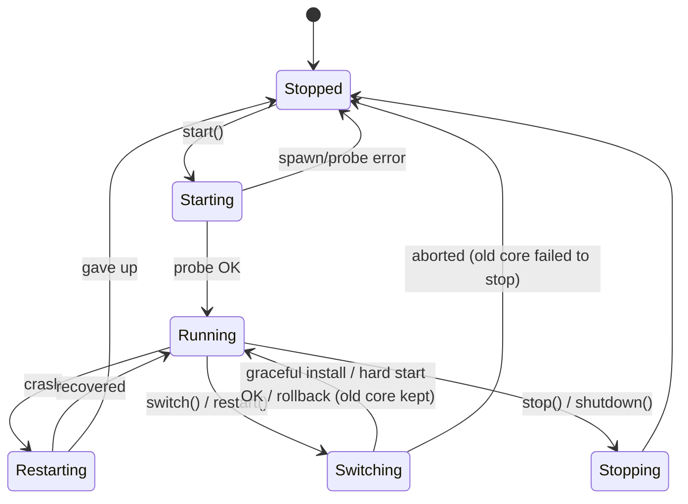

# nyanpasu-core-manager

Clash core lifecycle management: epoch-based instances, health-probed startup,
crash recovery, and hitless core switching.

The crate manages a proxy core process (mihomo, clash-rs, …) as an immutable,
single-epoch `Instance`, and layers a `CoreManager` on top that owns
start/stop/switch orchestration and publishes a unified `CoreStatus` snapshot
over a `watch` channel.

Key concepts:

- **Epochs and revisions** — an epoch is one process/controller lineage. A
  `ConfigRevision` identifies desired config within that epoch by generation
  and semantic hashes. Fully expressible changes can PATCH or reload the
  current epoch; switch-class changes allocate a new epoch.
- **Manager-owned snapshots** — both controller modes run from a private,
  stable `config-{epoch}.yaml`, never directly from the caller's mutable file.
  Supervisor respawns therefore reload the committed desired revision.
- **Health-probed startup and runtime status** — a start is only confirmed once
  its readiness probe passes. The default is `GET /version`; custom readiness
  and optional runtime liveness probes are installed through builders.
  `startup_timeout` is a *total* budget covering spawn, crash retries, grace,
  and threshold evaluation.
- **Supervision** — crash → backoff → respawn → re-probe, bounded by
  `RestartPolicy`/`Backoff` from `nyanpasu-utils`. Dropping an `Instance`
  without `stop()` kills the whole process tree.
- **Controller modes** — `Passthrough` preserves the endpoint written in the
  snapshot; `Managed` rewrites it to a per-epoch local transport (named pipe on
  Windows, unix socket elsewhere), which is required for graceful switching.

## Requirements on the config

The config must declare an external controller — it is the probe/control
channel. `external-controller-pipe` (Windows) / `external-controller-unix`
(Unix) take priority over `external-controller` (HTTP). Wildcard HTTP binds
(`0.0.0.0`, `::`, `:port`) are probed via loopback. For mihomo, the manager
sets `SAFE_PATHS` to the working dir plus the config dir.

## Instance state machine

Every instance starts in `Starting` and ends in exactly one `Stopped` state.
`InstanceStatus` publishes that lifecycle together with an orthogonal health
dimension in one watch snapshot, so a PID can never be paired with health from
another process run. `InstanceState` and `HealthState` are defined in
[`src/state.rs`](src/state.rs).

```mermaid
stateDiagram-v2
    [*] --> Starting: Instance::spawn
    Starting --> Running: readiness success threshold
    Starting --> Stopped: startup timeout / spawn failed / budget exhausted
    Running --> Restarting: process exited, restart budget left
    Restarting --> Running: respawn probe OK
    Restarting --> Stopped: budget exhausted / re-probe timed out
    Starting --> Stopping: stop()
    Running --> Stopping: stop() / Instance dropped
    Restarting --> Stopping: stop()
    Stopping --> Stopped: process tree dead
    Stopped --> [*]
```

While the lifecycle is `Starting` or `Restarting`, health is `Starting`.
Acknowledged `Running` begins as `Healthy`. If liveness is configured,
consecutive failures can change health to `Unhealthy` while lifecycle remains
`Running`; consecutive successes recover it to `Healthy`. A lone failure does
not flap the state. `Stopping` and `Stopped` carry no health value.

Readiness acknowledgement occurs exactly once for each child-process run.
Runtime recovery never acknowledges again, so health flapping cannot reset the
supervisor restart budget. `HealthStatus.changed_at` records only health
transitions; `CoreStatus.changed_at` remains the lifecycle transition time.

`Stopped` carries a `StopReason`:

| Reason | Meaning |
| --- | --- |
| `Finished` | Core exited cleanly (code 0); no restart attempt. |
| `User` | Stopped via `stop()` / manager shutdown. |
| `Error(msg)` | Crash loop exhausted, probe timeout, or unexpected exit; `msg` includes a condensed stderr tail. |

## Manager state machine

`CoreManager` republishes instance transitions as `CoreState` (adding the
epoch), plus the `Switching` state that only exists at the manager level.
Steady-state forwarding is installed once a start/switch confirms `Running`.



## Sequence diagrams

### Start

```mermaid
sequenceDiagram
    participant App
    participant M as CoreManager
    participant I as Instance (epoch N)
    participant S as Supervisor
    participant C as Core process

    App->>M: start(spec)
    M->>M: prepare(): inspect (Passthrough) or derive (Managed) config,<br/>resolve probe controller
    M->>I: spawn(spec, N, controller)
    I->>S: spawn(-m -d dir -f cfg, SAFE_PATHS=…)
    S->>C: exec
    loop immediate first attempt, then health.interval; within startup_timeout
        I->>C: GET /version
    end
    C-->>I: 200 OK
    I-->>M: Running { pid }
    M-->>App: Ok(())
    Note over M: forwarder mirrors instance transitions<br/>into the CoreStatus watch channel
```

### Runtime liveness (when configured)

```mermaid
sequenceDiagram
    participant D as Probe driver
    participant P as Custom liveness probe
    participant T as Health tracker
    participant W as watch&lt;InstanceStatus&gt;

    loop completion + health.interval
        D->>P: check(epoch, run_id/PID, Liveness)
        P-->>D: Healthy / Unhealthy
        D->>T: serialized observation
        T-->>W: Running + health transition/counters
    end
    Note over D,W: Reconcile checks share this queue;<br/>at most one probe is in flight per instance
    Note over T,W: Sustained Unhealthy is observe-only;<br/>the process is not restarted automatically
```

If a future release adds a restart reaction, it must be manager-owned and pass
through the existing stop confirmation, quarantine, and proof-of-death paths.
It must not call supervisor readiness acknowledgement on runtime recovery or
kill/restart an epoch directly from the probe driver.

### Graceful switch

Selected only in `Managed` mode when every inbound is provably zeroable and
restorable. The old core keeps serving while the new one starts from a
zero-inbound bootstrap. Both the bootstrap and full desired config pass the
core's config check before overlap begins.

```mermaid
sequenceDiagram
    participant App
    participant M as CoreManager
    participant A as Core A (epoch N)
    participant B as Core B (epoch N+1)

    App->>M: switch(spec B)
    M->>M: derive + validate full B and zero-inbound bootstrap B′
    M->>M: commit config-N+1.yaml = B′
    M->>B: spawn from config-N+1.yaml + wait_ready
    Note over A: A keeps serving traffic
    M->>A: stop_and_confirm_dead() — ports released
    M->>M: atomic replace config-N+1.yaml = full B
    M->>B: PATCH /configs, GET projection, health probe
    alt patch verified
        M-->>App: SwitchOutcome::Graceful
    else patch failed or uncertain
        M->>B: stop_and_confirm_dead(); restart from committed full B (same epoch)
        M-->>App: SwitchOutcome::Hard { PatchFailed }
    end
```

Any failure before the point of no return (derive, spawn, probe) rolls back
cleanly: the old core is untouched and `Running` is re-published.

### Switch degradation matrix

`switch()` / `restart()` return how the switch was actually executed:

| Condition | Outcome |
| --- | --- |
| No core currently running | plain start, `Hard { NotRunning }` |
| `ControllerMode::Passthrough` | `Hard { PassthroughMode }` |
| Core kind is not mihomo | `Hard { UnsupportedKind }` |
| Config sets `dns.listen` | `Hard { DnsListen }` |
| Another inbound cannot be proven safe for overlap | `Hard { InboundConflict }` |
| Listener-restore PATCH cannot be verified | same-epoch restart, `Hard { PatchFailed }` |
| Otherwise | `Graceful` |

If the runtime replacement was installed but parent-directory durability could
not be confirmed, either successful switch result is wrapped in
`SwitchOutcome::DurabilityUncertain`; callers should persist or report its
warning while treating the nested outcome as the reconciled result.

## Usage

### Start and stop (Passthrough)

```rust
use camino::Utf8PathBuf;
use nyanpasu_core_manager::{
    CoreKind, CoreManager, CoreSpec, InstanceOptions, InstanceSpec, ManagerOptions,
};

let spec = InstanceSpec {
    core: CoreSpec {
        kind: CoreKind::Mihomo,
        binary_path: Utf8PathBuf::from("/opt/nyanpasu/mihomo"),
        version: None, // display metadata only
        features: Vec::new(),
    },
    config_path: Utf8PathBuf::from("/opt/nyanpasu/config.yaml"),
    working_dir: Utf8PathBuf::from("/opt/nyanpasu"),
    pid_file: None,
    options: InstanceOptions::default(),
};

let manager = CoreManager::new(ManagerOptions {
    runtime_dir: Some(Utf8PathBuf::from("/run/nyanpasu/core-runtime")),
    ..ManagerOptions::default()
}).await?; // Passthrough controller, manager-owned runtime snapshot
manager.start(spec).await?; // resolves once the version probe passes
manager.stop().await?;
```

### Custom readiness and liveness

```rust
use std::{num::NonZeroU32, time::Duration};
use nyanpasu_core_manager::{
    CoreManager, HealthPolicy, ProbeHandle, ProbeResult,
};

spec.options.health = HealthPolicy::new(
    Duration::from_millis(250),
    Duration::from_secs(1),
    NonZeroU32::new(3).unwrap(), // failures before Unhealthy
    NonZeroU32::new(2).unwrap(), // successes before Healthy/ready
    Duration::from_secs(2),      // initial failure grace per process run
)?;

let tcp_liveness = ProbeHandle::from_fn("proxy-tcp", |context| async move {
    match tokio::net::TcpStream::connect(("127.0.0.1", 7890)).await {
        Ok(_) => ProbeResult::Healthy,
        Err(error) => ProbeResult::Unhealthy { detail: Some(error.to_string()) },
    }
});

let manager = CoreManager::builder(manager_options)
    // Omit readiness_probe() to retain ControllerVersionProbe.
    .liveness_probe(tcp_liveness)
    .build()
    .await?;
```

`.liveness_with_readiness_probe()` reuses one probe for both phases. Prefer
separate probes during graceful switching: the bootstrap intentionally zeroes
proxy listener ports, so a proxy-port TCP check is unsuitable for readiness
even though it is useful after `Running`.

### Managed mode + graceful switch

```rust
use camino::Utf8PathBuf;
use nyanpasu_core_manager::{ControllerMode, CoreManager, ManagerOptions, SwitchOutcome};
use tokio_util::sync::CancellationToken;

let manager = CoreManager::new(ManagerOptions {
    controller_mode: ControllerMode::Managed {
        derived_dir: Utf8PathBuf::from("/run/nyanpasu/derived"),
        // None → \\.\pipe\nyanpasu\core-{epoch} on Windows,
        //        <derived_dir>/core-{epoch}.sock elsewhere
        controller_template: None,
    },
    cancel_token: CancellationToken::new(),
    ..ManagerOptions::default()
}).await?;

manager.start(spec_a).await?;
match manager.switch(spec_b).await? {
    SwitchOutcome::Graceful => { /* zero-downtime switch */ }
    SwitchOutcome::Hard { reason } => { /* fell back to stop→start; see `reason` */ }
    SwitchOutcome::DurabilityUncertain { outcome, warning } => {
        /* `outcome` succeeded; persist/report `warning` */
    }
}
```

The manager writes `config-{N}.yaml` and `core-{N}.pid` in its runtime
directory. Managed mode may use `derived_dir` as the compatibility runtime-dir
alias; Passthrough requires `runtime_dir` explicitly. The advertised endpoint
is available as `CoreStatus.controller` in both modes.

### Apply config with revision CAS

```rust
use nyanpasu_core_manager::{ApplyOutcome, InstanceSpec};

let expected = manager.status().revision.as_ref().map(|revision| revision.id());
match manager.apply_config(next_spec, expected).await? {
    ApplyOutcome::Noop { revision }
    | ApplyOutcome::Patched { revision }
    | ApplyOutcome::Reloaded { revision }
    | ApplyOutcome::Restarted { revision } => { /* desired revision active */ }
    ApplyOutcome::RolledBack { revision, failed_apply } => {
        /* old revision restored; retain failed_apply for diagnostics */
    }
    ApplyOutcome::DurabilityUncertain { outcome, warning } => {
        /* `outcome` was reconciled; persist/report the durability warning */
    }
}
```

`expected_revision` is checked before staging or publishing. PATCH writes the
full desired file first, then requires `GET /configs` projection verification
and a health probe. Reload uses `PUT /configs`; uncertain reconciliation stops
and restarts from the committed snapshot. If that restart fails, the previous
runtime file is atomically restored and restarted.

### Watch status

```rust
use nyanpasu_core_manager::CoreState;

let mut rx = manager.subscribe();
tokio::spawn(async move {
    while rx.changed().await.is_ok() {
        let status = rx.borrow().clone();
        match status.state {
            CoreState::Running { epoch, pid } => { /* … */ }
            CoreState::Stopped { .. } => break,
            _ => { /* Starting / Restarting / Switching / Stopping */ }
        }
    }
});
```

`CoreStatus` also carries `changed_at` (unix ms of the last lifecycle
transition), `health`, `spec`, `controller`, and the active `ConfigRevision`.
These fields are published together, so a new epoch is never paired with the
previous epoch's controller or health.

## Runtime directory security and recovery

The runtime directory contains secret-bearing effective configuration. It is
created with owner-only permissions (0700 directory and 0600 files on Unix;
restricted ACLs on Windows), rejects symlinks/reparse points, and uses
same-directory atomic replacement. Unix fsyncs the file and parent directory;
Windows fsyncs staged content but does not claim power-loss durability for
`ReplaceFileW`, whose documented write-through flag is unsupported. Runtime
paths must remain inside that directory. A process-lifetime `.manager.lock`
prevents a second manager from sweeping or allocating epochs in an owned
directory.

If atomic replacement succeeds but parent-directory synchronization fails,
reconciliation continues from the installed desired file. `apply_config`
returns `ApplyOutcome::DurabilityUncertain` and graceful `switch()` returns
`SwitchOutcome::DurabilityUncertain`, each around the actual reconciled
outcome. Errors retain their original structured variant as the source of
`Error::DurabilityUncertain`.

Each pid record includes its epoch, executable identity, process start token,
and runtime path. `CoreManager::new` sweeps before accepting work: it validates
every record, kills only a fully matching live process, confirms death, removes
that epoch's yaml/pid/socket/backup/temp artifacts, and seeds the next epoch
above the maximum artifact epoch observed. If identity cannot be proven, the
manager fails construction instead of killing an uncertain process.

If an in-process stop cannot prove death, the epoch is quarantined. Start,
switch, restart, and config application return `Error::ManagerQuarantined`
until `recover_quarantine()` validates the epoch record, confirms death, and
cleans the retained artifacts. Recovery attempts every quarantined epoch and
retains an in-memory death proof if artifact cleanup must be retried. A missing
or unverifiable record never clears the quarantine. `stop()` and `shutdown()`
intentionally bypass this gate so they can reduce the number of live processes;
they do not clear quarantine.

Orphan termination is identity-bound to one open process handle on Windows and
to a pidfd on supported Linux kernels. Older Linux kernels and other Unix
targets revalidate the boot/start token and executable immediately before
signaling; a minimal PID-reuse window remains on those fallback paths.
Before killing a verified root, recovery captures its live descendant tree and
records each descendant's executable and start token. It then confirms every
captured identity is dead, skipping a PID that disappeared or changed identity.
A descendant that reparents before either capture snapshot observes it cannot
be attributed safely and is not killed; persistent group/job identity would be
needed to eliminate that residual gap.

### One-shot config validation

Runs the core with `-t` and condenses a failure into `Error::ConfigCheckFailed`:

```rust
manager.check_config(spec).await?;
// or, without a manager:
nyanpasu_core_manager::kind::check_config(spec).await?;
```

### Tuning startup and restarts

```rust
use std::time::Duration;
use std::num::NonZeroU32;
use nyanpasu_core_manager::{HealthPolicy, InstanceOptions};
use nyanpasu_utils::process::{Backoff, RestartPolicy};

let options = InstanceOptions {
    // Total budget for the initial start, crash retries included.
    startup_timeout: Duration::from_secs(30),
    health: HealthPolicy::new(
        Duration::from_millis(250), // delay after each completed probe
        Duration::from_secs(1),     // per-attempt timeout
        NonZeroU32::new(3).unwrap(),// failures before Unhealthy
        NonZeroU32::MIN,            // successes before Healthy/ready
        Duration::ZERO,             // failure grace per child run
    )?,
    restart_policy: RestartPolicy::OnFailure { max_restarts: 5 },
    backoff: Backoff::exponential(Duration::from_secs(1), Duration::from_secs(30))
        .with_jitter(),
};
```

The default readiness probe is `ControllerVersionProbe` with its fixed one
second HTTP timeout. Runtime liveness is off unless configured, preserving the
previous post-start behavior and overhead. `start_period` ignores initial
failures only; its first success ends the grace immediately. Threshold streaks
reset on the opposite result and on each new child-process run. None of these
settings extend the one absolute initial `startup_timeout` deadline.

## Testing

The unit/integration suite runs against `nyanpasu-fake-core`, a scripted
mihomo simulator built from `tests/helpers/fake_core.rs` (same CLI, behavior
driven by `x-fake-core` config keys):

```sh
cargo test -p nyanpasu-core-manager
```

A smoke suite runs the same manager against the real mihomo binary (download
it first, or point `MIHOMO_BIN` at one):

```sh
deno run -A scripts/prepare-mihomo.ts
cargo test -p nyanpasu-core-manager --test real_mihomo_smoke -- --ignored --nocapture
```

## Design

See `docs/superpowers/specs/2026-07-18-nyanpasu-core-manager-design.md` for the
full design spec this crate implements.
