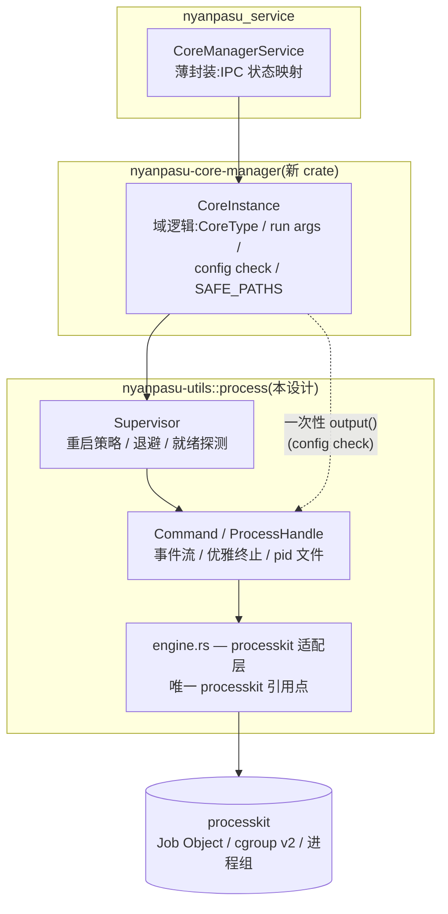

# nyanpasu-utils 子进程管理模块(`process`)设计文档

- 日期:2026-07-16(2026-07-17 增补第三方审计核验,见 §3.4)
- 状态:待评审(Draft)
- 范围:`crates/nyanpasu-utils` 新增 `process` 模块;`crates/nyanpasu-core-manager` 与 `nyanpasu_service` 的迁移路径
- 参考:tauri-plugin-shell(process 模块)、[processkit](https://zelanton.github.io/processkit/)

---

## 1. 背景与动机

### 1.1 现状

子进程管理逻辑目前散落在三处,且通用能力与业务域逻辑相互耦合:

| 位置 | 内容 | 性质 |
|------|------|------|
| `nyanpasu-utils/src/core/instance.rs` | `CoreInstance`:spawn、管道读取、事件流、kill | **通用子进程管理 + clash 域逻辑混合** |
| `nyanpasu-utils/src/os/child.rs` | `ChildExt::gracefully_kill`(CTRL_BREAK / SIGTERM) | 通用 |
| `nyanpasu-utils/src/os/mod.rs` | pid 文件读写、`kill_by_pid_file`、`pid_exists` | 通用 |
| `nyanpasu_service/src/server/instance.rs` | `recover_core` 手写重启循环(5 次、固定 5s 间隔)、事件消费、状态通知 | 监督(supervision)逻辑,本应下沉 |

`instance.rs:33` 已有明确的技术债标记:

```rust
// TODO: migrate to https://github.com/tauri-apps/tauri-plugin-shell/blob/v2/src/commands.rs
```

同时 `crates/nyanpasu-core-manager` 已建立(当前为空壳 crate),意图是把 clash 核心管理域逻辑从 nyanpasu-utils 中拆出。**本设计的 `process` 模块即为这次拆分提供通用底座。**

### 1.2 现有实现的问题清单

1. **线程模型陈旧**:基于 `os_pipe` + `std::thread` + `block_on` 回跳异步(源自 tauri v1 的实现),每个子进程至少消耗 3 个 OS 线程(stdout / stderr / wait),与全 tokio 的服务端架构不符。
2. **无进程树级清理**:运行时 kill 只作用于直接子进程(`SharedChild::kill`);`kill_tree` 仅用于启动前清理残留 pid。若核心进程产生孙进程(或未来接入会 fork 的核心),异常退出时会产生孤儿进程、端口占用。
3. **`Drop` 语义粗暴**:`CoreInstance::drop` 直接强杀,无优雅终止;且若宿主 panic,子进程存活与否取决于 Drop 是否被执行——没有内核级兜底。
4. **健康检查硬编码**:1.5s `DelayCheckpointPass` 写死在通用层,属于域逻辑泄漏。
5. **监督逻辑上浮**:重启、退避、状态通知全部由消费者(`nyanpasu_service`)手写,固定间隔无抖动,无 crash-loop 保护。
6. **事件通道容量为 1**:日志突发时反压管道读取线程;错误以 `String` 传递,丢失类型。
7. **stdin 不可用**(代码被注释),无法支持未来需要交互式 IO 的核心。
8. **Windows 优雅终止从未生效**(2026-07-17 根因分析确认):`GenerateConsoleCtrlEvent` 只能投递到与调用方共享同一控制台的进程组,而子进程经 `CREATE_NO_WINDOW` 挂在自己的隐形控制台上;服务模式(SCM,session 0)下父进程自身无控制台,调用直接报 `ERROR_INVALID_HANDLE`。失败被 `warn` 掩盖后无条件落入 `TerminateProcess`,CLI 模式还先白等 3 秒轮询。生产环境事实上一直是强杀。

### 1.3 澄清:tauri-plugin-process vs tauri-plugin-shell

tauri-plugin-**process** 只管理应用自身进程(`exit` / `relaunch`);真正的子进程管理位于 tauri-plugin-**shell** 的 `process` 模块(`Command` / `CommandChild` / `CommandEvent`)。本仓库现有代码正是从 tauri v1 的对应实现移植的(`utils.rs` 中注有 `Ref: tauri v1.7.1`)。本设计以 tauri-plugin-shell v2 的 **API 形态**为参考,以 processkit 为**执行引擎**候选。

---

## 2. 目标与非目标

### 2.1 目标

- G1:在 `nyanpasu-utils` 中提供独立、通用、与业务无关的 `process` 模块(feature = `"process"`),完全 tokio 原生。
- G2:API 形态延续 tauri-plugin-shell 风格(builder → `spawn()` → 事件流 + 句柄),使现有消费代码(`while let Some(event) = rx.recv().await`)迁移成本最小。
- G3:进程树级清理保证:句柄被 Drop(含 panic 展开)时,整棵进程树被内核对象兜底回收。
- G4:终止语义按平台如实定义:Unix `SIGTERM` → 宽限期 → 整树强杀;Windows 直接整树强杀(CTRL_BREAK 正式弃用,决策记录见 §5.6),替代 `os/child.rs`。
- G5:内置 `Supervisor`:重启策略、指数退避 + 抖动、就绪探测(替代 `DelayCheckpointPass` 与 `recover_core`)。
- G6:pid 文件生命周期管理(启动前查杀残留 → 写入 → 退出清理)作为可选能力集成。
- G7:为 `nyanpasu-core-manager` 提供清晰的构建底座,消化 `instance.rs:33` 的 TODO。

### 2.2 非目标

- 不实现 shell-free 管道(`a | b | c`)——当前无需求。
- 不实现资源限额(CPU / 内存 caps)——留作后续 feature,不进入首版 API。
- 不支持 PTY / 终端仿真。
- 不涉及提权启动(`os/elevated.rs` 保持独立)。
- 不在本次迁移上游 `clash-nyanpasu` 主程序(仅保证 API 可被其复用)。

---

## 3. 外部调研摘要

### 3.1 tauri-plugin-shell(API 形态参考)

核心形态:`Command`(builder:args / envs / current_dir / encoding)→ `spawn()` 返回 `(Receiver<CommandEvent>, CommandChild)`;`CommandEvent = Stdout | Stderr | Error | Terminated(TerminatedPayload)`;`CommandChild` 提供 `write` / `kill` / `pid`。v2 内部仍为 `shared_child` + `os_pipe` + 线程,**只解决 API 形态问题,不解决线程模型与进程树清理问题**。

### 3.2 processkit(执行引擎候选)

来源:官方文档站与 crates.io API(2026-07-16 抓取),两处交叉验证。

**能力**(与本设计相关的子集):

- **内核级整树 kill-on-drop**(核心差异化):Windows Job Object / Linux cgroup v2(无委派时回退 POSIX 进程组)/ macOS·BSD POSIX 进程组;`mechanism()` 可查询实际生效机制,不静默降级。
- tokio 原生;`Command::start()` → `RunningProcess`,提供 `stdout_lines()` 行流、后台 stderr 排空、`keep_stdin_open()` 交互写入。
- `Supervisor`:重启策略、有界重启次数、指数退避 + 默认抖动、crash-loop 风暴防护(半衰期评分)。
- 就绪探测(readiness probe):替代"sleep 猜测",探测失败不杀死子进程。
- `timeout` 到期杀整树、`CancellationToken`(re-export 自 tokio-util,与本仓库现有取消体系同源)。
- 测试缝:`ProcessRunner` trait + Scripted / Recording / RecordReplay 测试替身(`mock` / `record` feature)。
- 信号、挂起/恢复(默认 feature `process-control`)。

**成熟度与风险**(依据 crates.io API 数据,置信度:高):

| 维度 | 事实 | 评估 |
|------|------|------|
| 最新版本 | 2.2.5(版本史自 0.3.x 快速迭代至 2.x) | 官网 Quickstart 仍写 `processkit = "1"`,**文档滞后于发布**,实施时以 docs.rs 为准 |
| 总下载量 | ~7,000 | 采用率低,社区验证不足 |
| 维护者 | 单人(ZelAnton),自述大量使用 AI 辅助开发 | 长期维护风险,需封装隔离 |
| 许可证 | MIT | 与本项目 GPL-3.0 兼容,无阻碍 |
| MSRV | 1.88 | 本项目 edition 2024(rustc ≥ 1.85),**CI 工具链需确认 ≥ 1.88** |

### 3.3 能力对比

| | 整树 kill-on-drop | tokio 异步 | 监督/退避 | 就绪探测 | 测试缝 | 维护状态 |
|---|---|---|---|---|---|---|
| 现有实现(tauri v1 移植) | ✗ | ✗(线程) | ✗(消费者手写) | 硬编码 1.5s | ✗ | 本仓库自维护 |
| tauri-plugin-shell v2 | ✗ | ✗(线程) | ✗ | ✗ | ✗ | tauri 团队,活跃 |
| command-group crate | ✓(仅直接组) | ✓ | ✗ | ✗ | ✗ | 活跃 |
| **processkit** | ✓(内核对象) | ✓ | ✓ | ✓ | ✓ | 年轻、单人 |

### 3.4 第三方审计与源码核验(2026-07-17 增补)

一份针对 ProcessKit-rs 的第三方静态审计(ChatGPT 深度审计,基线 commit `2adad32`,即 2.2.5 对应源码)提出 7 项发现(A-01~A-07)。我们克隆同一 commit 逐条核验,**全部属实**。对本项目的适用性映射:

| 审计项 | 内容 | 对我们的影响 | 处置 |
|--------|------|--------------|------|
| A-01/A-04(高/中) | 发布流程可致 crates.io 包与 Git tag 源码不一致;CI action 未锁 SHA | 供应链信任问题,不影响代码本身 | **以 git 依赖锁定到已核验 commit SHA**(nyanpasu-utils 经 git 分发,无 crates.io 发布约束),绕开注册表工件,A-01 即被中和 |
| A-02(高,条件性) | POSIX 进程组后端可被 `setsid()` 逃逸;宿主被 SIGKILL 时 Linux cgroup 不自动清理;降级警告需 `tracing` feature | 我们的子进程是合作型 clash 核心,非对抗场景;宿主 SIGKILL 场景现状同样存在 | §5.4 pid 文件查杀残留即为此兜底(保留);Windows Job Object 内核级 kill-on-close 不受影响;引擎层启用 processkit `tracing` feature + 启动时记录 `mechanism()` |
| A-03(中) | 旧内核 cgroup 硬杀回退存在 PID 复用误杀竞态 | 仅限无 `cgroup.kill` 的旧内核/受限容器 | 列入 O3 目标环境验证;我们自己的 pid 查杀路径保留可执行名校验 |
| A-05(中) | stdout/stderr 默认无界缓存,长时运行的多话子进程可致父进程 OOM | **直接命中**:clash 核心持续输出日志,流式模式下后台排空的 stderr 默认也在内存中无界累积 | 引擎层硬性要求:`OutputBufferPolicy` 设为有界环形缓冲(如 `with_max_bytes(256 KiB)`),事件泵即时消费两路输出 |
| A-06(中低) | record/replay 测试摘要用非密码学哈希 | 不使用该 feature,类型不泄漏原则下也不进公开 API | 无 |
| A-07(低) | 稀有 cgroup 回退路径同步 sleep 阻塞 tokio worker | 同 A-03 条件 | 同 O3 |

核验中另确认两项**审计未覆盖、但对本设计更关键**的 API 事实:

1. **Windows 无优雅终止支持,且无法注入 `CREATE_NEW_PROCESS_GROUP`**:processkit 的 `Command` 只暴露 `create_no_window()`,无通用 creation flags 入口;`GenerateConsoleCtrlEvent`/CTRL_BREAK 在代码库中完全缺席,Windows 下 `shutdown()` 退化为直接硬杀,文档自述"需要握手的关停必须带外发信号"。曾据此计划"自行 spawn + `adopt()`"以保留 CTRL_BREAK;随后对本仓库的根因分析(§5.6 决策记录)证实 CTRL_BREAK 在现实现中**从未生效**且无合理修复,该分支整体作废——Windows 直接使用 processkit 原生 `Command`,与 processkit "Windows 无优雅层"的设计立场一致。原 O1 关闭。
2. **编码问题已解决**:`Command::stdout_encoding/stderr_encoding(&'static Encoding)` 原生基于 encoding_rs(含 GBK),`OutputEvents` 流同时给出 stdout/stderr 行事件。原 O2 关闭,§5.5 的降级预案作废。

审计同时点名的代码质量正面项(pidfd 信号纪律、Windows suspended-spawn 后入 Job 再恢复、PID 复用防护 PidGate、权限降低顺序等)经抽查属实——**这些恰是自研方案 B 最难做对的部分**,反而强化了方案 A 的依据。

---

## 4. 方案对比

### 方案 A:引入 processkit 作为内部引擎,公开自有 API(推荐)

`nyanpasu_utils::process` 定义自有的 `Command` / `ProcessEvent` / `ProcessHandle` / `Supervisor` 类型,内部委托 processkit 执行;**processkit 类型不出现在任何公开签名中**。

- 优点:立即获得整树清理、监督、就绪探测、测试缝,删除 ~500 行手写线程/管道代码;API 自主可控,依赖可替换(接口不变、换内核即可);MIT 许可无碍。
- 缺点:引入年轻依赖(见 3.2 风险表);Windows 优雅终止(CTRL_BREAK)需自行保留实现并与 Job Object 协同(见 §5.6 与开放问题)。

### 方案 B:自研移植 tauri-plugin-shell v2(履行原 TODO 字面意思)

按 `commands.rs` 移植为 tokio 原生实现,另接 command-group 或手写 Job Object / 进程组获得部分整树清理。

- 优点:零新增第三方核心依赖,行为完全自控。
- 缺点:tauri-shell v2 本身仍是线程模型,"移植 + 异步化 + 整树清理 + 监督"实际是从头造一个 processkit 的子集;跨平台内核对象(Job Object / cgroup)正确性验证成本高;监督、退避、风暴防护仍需自写。

### 方案 C:自研核心 + command-group 补整树清理

在方案 B 基础上用 command-group 提供进程组/Job Object。

- 优点:依赖小而成熟。
- 缺点:command-group 只覆盖"直接进程组",无 cgroup v2、无监督、无就绪探测、无测试缝;剩余工作量与方案 B 相当。

### 推荐:方案 A

理由:本模块的差异化需求(整树清理、监督、就绪探测)恰好是 processkit 的核心卖点,自研等于低质量复刻;其最大风险(年轻、单人维护)通过**类型不泄漏的封装**被限制在一个模块内部——若未来 processkit 停止维护或出现缺陷,可在不动任何消费方代码的前提下将内核换成自研实现(即降级为方案 B,且届时已有稳定 API 与测试基线)。**方案 B 作为明确的 fallback 路径保留在本文档中。**

---

## 5. 模块设计(方案 A 展开)

### 5.1 crate 布局与 feature

```text
crates/nyanpasu-utils/src/process/
├── mod.rs          # 公开 API 出口与文档
├── command.rs      # Command builder + spawn/output
├── handle.rs       # ProcessHandle(kill/graceful_kill/write_stdin/wait)
├── event.rs        # ProcessEvent / TerminatedPayload / 事件泵
├── supervisor.rs   # Supervisor + RestartPolicy + ReadinessProbe
├── pid_file.rs     # pid 文件生命周期(吸收 os/mod.rs 对应函数)
└── engine.rs       # processkit 适配层(唯一允许 import processkit 的文件)
```

- 新增 feature:`process = ["dep:processkit", "dep:encoding_rs", "os"]`(依赖 `os` 是为了过渡期复用 `pid_exists` 校验;pid 相关函数迁完后可解除)。
- `core_manager` feature 改为依赖 `process`(过渡期新旧实现并存,见 §6)。
- 约束:`processkit` 仅允许在 `engine.rs` 中被引用,以 clippy `disallowed_types`/code review 保证不泄漏。

### 5.2 公开 API 草图

```rust
use nyanpasu_utils::process::{Command, ProcessEvent, KillBehavior};

let (handle, mut events) = Command::new("mihomo")
    .args(["-d", app_dir, "-f", config_path])
    .env("SAFE_PATHS", safe_paths)
    .current_dir(app_dir)
    .hide_window(true)                      // Windows: CREATE_NO_WINDOW;其他平台 no-op
    .encoding(None)                          // None = UTF-8 lossy;Some(GBK) 等按需
    .stdout_channel_capacity(64)             // 默认 64,替代现有 capacity(1)
    .kill_grace(Duration::from_secs(5))      // Unix 优雅宽限期,默认 5s;Windows 无优雅阶段(§5.6)
    .pid_file(pid_path)                      // 可选:启动前查杀残留 + 写入 + 退出清理
    .spawn()
    .await?;

while let Some(event) = events.recv().await {
    match event {
        ProcessEvent::Stdout(line) => tracing::info!("{line}"),
        ProcessEvent::Stderr(line) => tracing::error!("{line}"),
        ProcessEvent::Error(msg)   => { /* IO/解码错误,进程可能仍存活 */ }
        ProcessEvent::Terminated(payload) => { /* code / signal */ break }
    }
}

handle.graceful_kill().await?;   // CTRL_BREAK / SIGTERM → 宽限期 → 整树强杀
```

关键类型:

```rust
pub struct Command { /* builder,字段全私有 */ }

impl Command {
    pub fn new(program: impl AsRef<OsStr>) -> Self;
    // args / env / envs / current_dir / encoding / hide_window
    // kill_grace / pid_file / stdout_channel_capacity / timeout
    pub async fn spawn(self) -> Result<(ProcessHandle, Receiver<ProcessEvent>), ProcessError>;
    pub async fn output(self) -> Result<ProcessOutput, ProcessError>; // 一次性执行,取代 check_config 内联的 TokioCommand
}

#[non_exhaustive]
pub enum ProcessEvent {
    Stdout(String),
    Stderr(String),
    Error(String),                 // 与现有消费方语义对齐:非致命 IO/解码错误
    Terminated(TerminatedPayload), // { code: Option<i32>, signal: Option<i32> } — 与现有结构一致
}

pub struct ProcessHandle { /* Arc 内部共享,Clone */ }

impl ProcessHandle {
    pub fn pid(&self) -> u32;
    pub async fn write_stdin(&self, data: &[u8]) -> Result<(), ProcessError>;
    pub async fn graceful_kill(&self) -> Result<(), ProcessError>; // §5.6
    pub async fn kill(&self) -> Result<(), ProcessError>;          // 直接整树强杀
    pub async fn wait(&self) -> Result<TerminatedPayload, ProcessError>;
    pub fn containment(&self) -> Containment; // JobObject | CgroupV2 | ProcessGroup — 透传引擎机制,可观测
}

#[derive(Debug, thiserror::Error)]
pub enum ProcessError {
    Io(#[from] std::io::Error),
    SpawnFailed { program: String, source: ... },
    Timeout { partial_stdout: String, partial_stderr: String },
    AlreadyExited,
    // ...
}
```

设计决定:

- **事件通道沿用 `tokio::sync::mpsc::Receiver`**,不引入自定义 Stream 类型——消费方迁移只需改事件枚举名。
- **`DelayCheckpointPass` 从事件枚举中移除**:它是"启动 1.5s 存活即视为就绪"的域约定,归属 Supervisor 的就绪探测(§5.3),由 core-manager 层映射回原语义。
- **`ProcessEvent` 标注 `#[non_exhaustive]`**,为将来扩展(如 `Ready`)留余地。
- 错误保持 `Error(String)` 事件 + 类型化 `ProcessError` 返回值双轨:事件流中的错误仅用于日志/诊断(与现状一致),控制流错误走 `Result`。

### 5.3 Supervisor

替代 `nyanpasu_service::server::instance::recover_core` 的手写循环:

```rust
let supervisor = Supervisor::builder(command_factory /* Fn() -> Command */)
    .restart_policy(RestartPolicy::OnFailure { max_restarts: 5 })
    .backoff(Backoff::exponential(Duration::from_secs(1), Duration::from_secs(30)).with_jitter())
    .readiness(ReadinessProbe::AliveAfter(Duration::from_millis(1500))) // 兼容现有 1.5s 语义
    .on_event(|e: SupervisorEvent| { /* 状态通知桥接 state_changed_notify */ })
    .spawn()
    .await?;

// SupervisorEvent: Started { pid } | Ready | Exited(TerminatedPayload)
//                | Restarting { attempt, delay } | GaveUp | Stopped
supervisor.stop().await?;   // 优雅停止:不再重启 + graceful_kill 当前实例
```

- `ReadinessProbe::AliveAfter(Duration)`:延迟检查点,首版唯一实现;`#[non_exhaustive]`,未来可加 `Custom(async fn)`(如探测 clash API 端口)。
- 内部优先复用 processkit 的 Supervisor(含风暴防护);若其事件粒度不满足 `SupervisorEvent` 需求,则在引擎层用 `RunningProcess` + 自有循环实现,**策略语义以本节 API 为准,不随引擎妥协**。
- 与 `CancellationToken` 集成:`Supervisor::builder(...).cancel_token(token)`,取消即 `stop()`,与 `nyanpasu_service` 现有关停体系直接对接。

### 5.4 pid 文件

吸收 `os/mod.rs` 中 `create_pid_file` / `get_pid_from_file` / `kill_by_pid_file` 为 `process::pid_file` 子模块,并将行为组合进 `Command::pid_file(path)`:

1. spawn 前:若 pid 文件存在且进程存活(经可执行名校验,沿用现有 validator 语义)→ 整树查杀 + 删除文件;
2. spawn 后:写入新 pid;
3. `Terminated` 后 / handle Drop:尽力删除文件(容错,不影响主流程)。

`os/mod.rs` 原函数保留 `pub use` 转发 + `#[deprecated]`,一个版本周期后移除。

### 5.5 事件泵与编码

- 引擎层经 processkit `OutputEvents` 流拉取 stdout/stderr 行事件转发入 mpsc;编码直接使用 processkit 原生的 `stdout_encoding/stderr_encoding`(基于 encoding_rs,含 GBK),`Command::encoding(None)` 映射为默认 UTF-8(已核验,见 §3.4)。
- **缓冲纪律(硬性要求,源自审计 A-05)**:processkit 默认输出缓冲无界,长时运行的核心进程会导致内存无界增长;引擎层必须设置有界环形缓冲(`with_max_bytes`,默认 256 KiB)并即时消费两路输出,`finish()` 保留的 stderr 尾部仅用于终止诊断(对应现有 `err_buf` 语义)。
- 事件顺序保证与现状一致:`Terminated` 必为通道最后一条事件(引擎层在 stdout/stderr 泵结束后再发送,复用现有 guard 思路但以 tokio task + `JoinSet` 实现,无 OS 线程)。

### 5.6 终止语义与平台矩阵

`graceful_kill()` 语义按平台如实定义,整合并取代 `os/child.rs`:

| 阶段 | Windows | Unix |
|------|---------|------|
| 1. 优雅通知 | **无**(CTRL_BREAK 已弃用,见下方决策记录) | `SIGTERM`(processkit `shutdown(grace)` 原生:SIGTERM → 宽限 → SIGKILL,发往整组) |
| 2. 宽限等待 | 不适用 | 由 `shutdown(grace)` 一体承担(`kill_grace`,默认 5s) |
| 3. 强杀 | Job Object 整树终止 | cgroup / 进程组整树终止 |
| Drop / panic 兜底 | Job Object kill-on-close(宿主被强杀亦生效) | cgroup / 进程组 SIGKILL(宿主被 SIGKILL 时不触发,由 pid 文件在下次启动兜底,见 §5.4) |

> **决策记录:弃用 Windows CTRL_BREAK(2026-07-17)**
>
> 现实现的 `GenerateConsoleCtrlEvent(CTRL_BREAK_EVENT, pid)` **从未生效**,根因(Microsoft 文档 + 代码核验):
>
> 1. 控制台信号只能投递到**与调用方共享同一控制台**的进程组;子进程经 `CREATE_NO_WINDOW` 挂在自己的隐形控制台上,跨控制台投递按设计不可能——服务与 CLI 两种模式双双失效;
> 2. 生产环境(SCM 服务,session 0)父进程根本没有控制台,调用直接失败(`ERROR_INVALID_HANDLE`);
> 3. 失败被 `warn` 掩盖后无条件落入 `TerminateProcess`,故问题从未暴露。
>
> 修复途径均与收益不成比例:进程内 AttachConsole 舞步(进程全局控制台状态,并发查杀需全局互斥,CLI 模式会打断自身 stdio)、独立 helper exe(打包/签名/分发成本)、windows-kill 式 CtrlRoutine 远线程注入(杀软误报);`taskkill`(无 `/F`)对无窗口控制台程序无效;无现成 Rust crate。而弃用的代价接近零:mihomo 优雅关停仅多做一次 fake-IP 池状态落盘(cache.db 为 bbolt,崩溃安全;wintun 残留适配器下次启动自清理),且生产环境事实上一直是强杀,无已知损害。域级替代(external controller)目前无 `/shutdown` 端点,`/restart` 会 re-exec 逃离监督,不可用。
>
> **结论:Windows 优雅通知完全弃用。** 若未来 mihomo 提供关停 API,正确的扩展点是 core-manager 层在 `graceful_kill` 前调用领域钩子(HTTP),而非控制台信号。

- Windows spawn 直接使用 processkit 原生 `Command`(**不再需要** `CREATE_NEW_PROCESS_GROUP`、自行 spawn 或 `adopt()`);`hide_window(true)` 映射为 `create_no_window()`(服务端默认开启;Unix no-op)。
- Windows 上 `graceful_kill()` 与 `kill()` 行为等价,文档如实标注——不再有"假优雅"阶段,顺带消除 CLI 模式下 3 秒无效等待。
- 替代现有 `ChildExt::gracefully_kill` 的 100ms × 30 轮询——Unix 改为事件驱动等待。

### 5.7 架构图



---

## 6. 迁移计划

| 阶段 | 内容 | 验收 |
|------|------|------|
| P0 | PoC:验证 O3(目标环境 `mechanism()` 断言;O1/O2 均已关闭,工作量约 2 小时) | PoC 结论回填本文档,决定 A 或降级 B。**✅ 2026-07-17 完成**:Windows 实测 `JobObject` + kill-on-drop 通过(`examples/containment_probe.rs`),方案 A 放行 |
| P1 | `nyanpasu-utils` 落地 `process` 模块(Command/Handle/事件泵/graceful_kill/pid 文件) | 单元 + 集成测试通过;新旧模块并存,零消费方改动。**✅ 2026-07-17 完成**(子模块分支 `feat/utils-process-module`,34 测试全绿) |
| P2 | `Supervisor` 落地 | 重启/退避/就绪探测集成测试。**✅ 2026-07-17 完成**(同分支) |
| P3 | `nyanpasu-core-manager` 实装:迁入 `core/` 域逻辑(definition.rs 全部、instance.rs 重写于新底座、`parse_check_output` 等),`nyanpasu-utils::core` 标 `#[deprecated]` | core-manager 通过与现 `CoreInstance` 等价的行为测试 |
| P4 | `nyanpasu_service` 切换至 core-manager;删除 `recover_core` 手写循环与 `os/child.rs`(经 deprecated 周期) | 服务端到端:启动/停止/崩溃自恢复/关停 |
| P5(仓库外) | 上游 `clash-nyanpasu` 主程序跟进采用 | 不在本仓库范围,仅保证 API 兼容其场景 |

每阶段独立可合并,P1/P2 期间现有代码路径完全不受影响。

---

## 7. 测试策略

- **单元测试**:builder 校验、事件顺序(Terminated 恒为最后)、pid 文件生命周期、退避序列(注入时钟,`tokio::time::pause`)。
- **集成测试**(真实小进程,跨平台 CI):
  - 长输出流式读取无丢行(对照 capacity=1 的旧回归);
  - `graceful_kill`:Unix 用可捕获 SIGTERM 的测试子进程验证三段式;Windows 断言其与 `kill()` 等价(直接整树强杀);
  - 整树清理:子进程再 spawn 孙进程,Drop 后断言孙进程消失(`containment()` 按机制分支断言);
  - Supervisor:子进程按脚本退出,断言重启次数、退避与 `GaveUp`。
- **等价性测试**(P3):对 `CoreInstance` 新旧实现跑同一组启动/崩溃/停止场景,断言对外事件序列等价。
- processkit 自带的 mock/cassette 测试缝**不进入**我们的公开 API(类型不泄漏原则);模块内部引擎层测试可选用。

---

## 8. 验收标准

1. `nyanpasu_service` 中不再存在手写重启循环与轮询等待;
2. 强杀路径在三平台均为整树语义,并有集成测试证明孙进程被回收;
3. 子进程 IO 全链路无新增 OS 线程(`std::thread::spawn` 在 process 模块中出现次数为 0);
4. 现有消费方迁移 diff 限于:类型改名 + 事件枚举去掉 `DelayCheckpointPass` 分支(就绪语义由 Supervisor 事件承接);
5. `instance.rs:33` 的 TODO 被移除。

---

## 9. 风险与开放问题

| # | 问题 | 影响 | 处置 |
|---|------|------|------|
| ~~O1~~(已关闭) | Windows 优雅终止:根因分析证实 CTRL_BREAK 在现实现中从未生效(跨控制台投递不可能 + 服务进程无控制台),且所有修复途径与收益不成比例,**正式弃用**(§5.6 决策记录);自行 spawn + `adopt()` 分支随之作废 | Windows 无优雅通知——与生产环境实际行为一致,非回退 | 已消化进设计;未来经 core-manager 域级钩子(HTTP)扩展 |
| ~~O2~~(已关闭) | ~~行流是否提供字节级访问~~ 已核验:`stdout_encoding/stderr_encoding` 原生支持 encoding_rs(含 GBK) | — | §5.5 直接采用,无降级预案 |
| O3(部分关闭) | processkit 在 Windows Server / 无 cgroup 委派的 Linux(容器内)上的 `mechanism()` 实际回退行为;旧内核硬杀回退存在 PID 复用竞态与同步 sleep(审计 A-03/A-07,已证实) | 整树保证弱化为进程组语义;窄条件下误杀/阻塞风险 | **2026-07-17:Windows 开发机实测 `JobObject` 通过**(探针 example 保留,可在任意目标环境复跑);Linux/macOS 留待 CI 矩阵;`ProcessHandle::containment()` 已暴露可观测性 |
| R1 | processkit 年轻(2.2.5、~7k 下载、单人维护、AI 辅助开发自述) | 断维护 / 潜在缺陷 | 类型不泄漏封装 + 方案 B 为 fallback + 引擎层面积控制在单文件。第三方审计与我方源码核验(§3.4)确认代码质量与并发纪律高于同类,信心增强 |
| R2 | 官网文档版本(写 `"1"`)与实际发布(2.2.5)不一致 | 按官网示例实施会踩 API 差异 | 实施以 docs.rs 对应版本为准 |
| R3 | MSRV 1.88 | CI 构建失败 | 实施前确认 CI 工具链版本 |
| R4(新增) | 供应链:发布流程可致 crates.io 包与 Git tag 源码不一致;CI 未锁 action SHA(审计 A-01/A-04,已证实) | 注册表工件不可完全信任 | **不经 crates.io 引入**:git 依赖锁定到已核验 commit(当前 `2adad32`);升级时重新核验目标 commit |
| R5(新增,已消化) | 默认输出缓冲无界,长时运行子进程致父进程 OOM(审计 A-05,已证实) | 服务内存无界增长 | §5.5 缓冲纪律:有界环形缓冲为引擎层硬性要求 |
| R6(新增,已消化) | POSIX 进程组后端可被 `setsid()` 逃逸;宿主 SIGKILL 时 Linux cgroup 残留(审计 A-02,已证实) | 仅影响对抗性子进程场景(非本项目威胁模型);宿主强杀场景与现状一致 | 合作型核心 + §5.4 pid 文件兜底;引擎层启用 `tracing` feature 使降级告警可见 |

---

## 10. 参考资料

- processkit 官方文档:https://zelanton.github.io/processkit/ (2026-07-16 抓取)
- processkit crates.io 元数据(版本 2.2.5、MIT、下载量):https://crates.io/api/v1/crates/processkit (2026-07-16 抓取)
- tauri-plugin-shell v2 源码:https://github.com/tauri-apps/plugins-workspace/tree/v2/plugins/shell
- ProcessKit-rs 第三方审计(基线 commit `2adad32`):https://chatgpt.com/share/6a590f57-8430-83ea-91aa-38bfe41bb32d ;我方逐条源码核验结论见 §3.4(2026-07-17)
- 现有实现:`crates/nyanpasu-utils/src/core/instance.rs`、`src/os/child.rs`、`nyanpasu_service/src/server/instance.rs`
